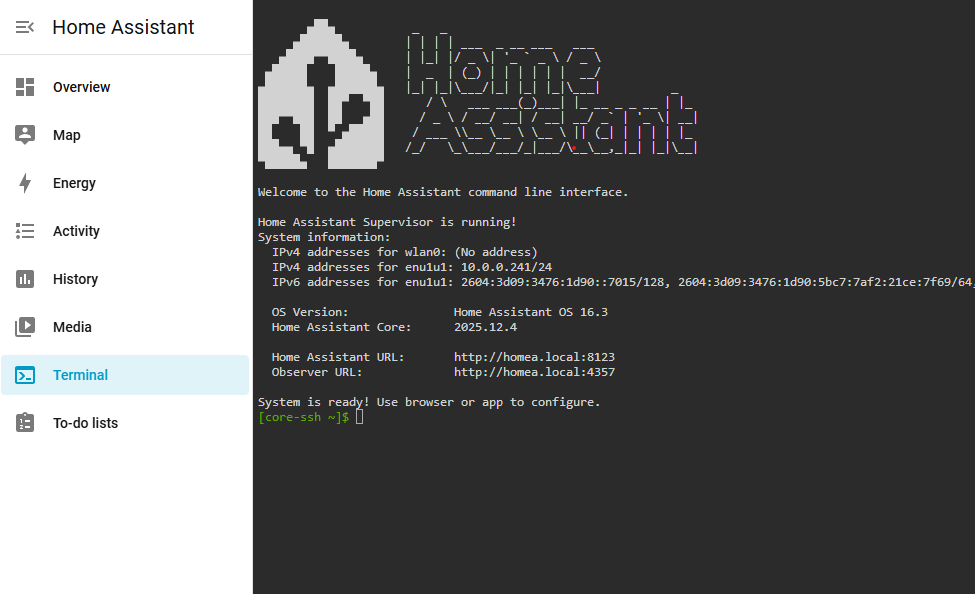

# Everything about Home-Assistant

by marcuz-apl | 28 December 2025


A Home-Assistant project can be as easy as running up with a HAOS on a Raspberry PI. But there might be some pitfalls on the way. Also, we'll try the Home-Assistant in Docker Container.


## Part 1- Home-Assistant OS on Raspberry Pi 3B+


### Setup a HAOS on a Raspberry PI 3B+

1. Go to [Raspberry PI - Software](https://www.raspberrypi.com/software/) site to download the **Raspberry Pi Imager**, and install such on Windows or Linux or macOS.

2. Launch the Raspberry Pi Imager app and pick up the correct image for you:
   1. Device: Raspberry PI 3.
   2. OS: Other specific-purpose OS -> Home Automation -> Home Assistant -> Home Assistant OS 16.3 (RPI 3).
   3. Storage: the MicroSD card (32GB?)
   4. Writing: Click "Yes" to proceed.
   5. Done.
3. Plug the MicroSD card back to the Raspberry Pi 3B+ and boot it up with a Ethernet connection. Then the HassOS 16.3 will boot up by itself.
4. Once it's up, use "Angry IP Scanner" to figure out the local private IP address.


### Configure the HAOS on Raspberry Pi 3B+

**1- Access the HAOS website**: Say my local IP address is 10.0.0.241, then from a side PC, browse to http://10.0.0.241:8123. 


**2- Finish off the On-boarding**: The system shall bring you to a onboarding page of the HAOS, where you get a chance to create a local HAOS user and the relevant password, etc. Here are some snapshots of such process.

At the "**Welcome!**" window, click "Create my smart home" to proceed.


At the "**Create user**" step, note down the username and password you define here for future use.


At the "**Home location**" step, even though you you type in the exact home address with your postal code, the pin point cannot be exactly whatsoever location. Then you can go to Google Maps, locate your home location, right click to copy the Lat/Lon pair and paste into the "Search Address" box, you shall get the exact location, feel free to move the pin to the exact location of your home.


At the "**Help us help you**" step: Nothing to change here, proceed to next step.


Finally you are able to find compatible devices! Hola.


**3- Setup SSH to access the container of HAOS**: Once loaded, Click "**Settings**" icon at lower-left corner.


**4- Add SSH function**: Click "**Add-ons**" -> choose "**Terminal & SSH**" at the Official add-ons page. Then click "**Install**" to install it. And eventually pin the "Terminal & SSH" to the left pane.

**5- Locate the Terminal inside the HAOS container**: Click "Terminal" at the left pane, you shall see the Home Assistant command line interface page in black and white:



**6- Configure the forwarding and add the trusted proxies**: 

```shell
pwd
## /root
whoami
## root even though it presents a "$" symbol.
nano ./config/configuration.yaml
```

Add the following lines and save the .yaml file.

```text
http:
  use_x_forwarded_for: true
  trusted_proxies:
  	- 10.0.0.50     ## Internal IP address of where the reverse proxy is located
  	- 68.146.xx.xx  ## Publich Ip address
```


**7- Add 2 entries of "WebSocket" in the proxy header file**: Go to the Synology NAS - Web UI, open "**Control Panel**" -> "**Login Portal**" -> "**Advanced**" tab -> "**Reverse Proxy**" -> select the very proxy: homea.example.com, which is reverse-proxied to 10.0.0.241:8123 -> click "**Edit**". Then switch to "**Custom Header**" tab; click "**Create**" to select "**WebSocket**", then the following 2 lines shall be in place:

```text
Upgrade = $http_upgrade
Connection = $connection_upgrade
```

The save such and exit.


As such, there will be no "Error 400: Bad Request", nor "Error 500: Bad Gateway".


Hola, Job got done completely.


## End