# Everything about Home-Assistant OS

by marcuz-apl | 28 December 2025


A Home-Assistant project can be as easy as running up with a HAOS on a Raspberry PI. But there might be some pitfalls on the way.


## Part 2- Install HA Supervised on a Raspberry Pi Equiv.

> [!WARNING]
>
> This installation method is unsupported with the Home Assistant OS 2025.12.0 release. See the [Deprecating Core and Supervised installation methods, and 32-bit systems](https://www.home-assistant.io/blog/2025/05/22/deprecating-core-and-supervised-installation-methods-and-32-bit-systems/) blog post for more information.

> [!IMPORTANT]
>
> This installation method is for advanced users only!
>
> The Supervised Debian installation is an opinionated appliance. That means it has many dependencies and bundles default configuration files for system services!
>
> Make sure you understand [the requirements](https://github.com/home-assistant/architecture/blob/master/adr/0014-home-assistant-supervised.md).

> [!WARNING]
>
> As of December 2025, the HA Supervised doesn't support a old version of HA nor Raspberry PI 2B+ (32-bit), though you can find image of rpi2-16.3.tar.xz, which introduced a lot of incapacity.

This installation method provides the full Home Assistant experience on a regular operating system. This means, all components from the Home Assistant method are used, except for the Home Assistant Operating System. This system will run the Home Assistant Supervisor. The Supervisor is not just an application, it is a full appliance that manages the whole system. It will clean up, repair or reset settings to default if they no longer match expected values.

By not using the Home Assistant Operating System, the user is responsible for making sure that all required components are installed and maintained. Required components and their versions will change over time. Home Assistant Supervised is provided as-is as a foundation for community supported do-it-yourself solutions. We only accept bug reports for issues that have been reproduced on a freshly installed, fully updated Debian with no additional packages.

This method is considered advanced and should only be used if one is an expert in managing a Linux operating system, Docker and networking.


**1- Prepare image of Debian OS Lite** (a.k.a. Debian 12 bookworm CLI)

* Go to [Raspberry PI - Software](https://www.raspberrypi.com/software/) site to download the **Raspberry Pi Imager**, and install such on Windows or Linux or macOS.

* Launch the Raspberry Pi Imager app and pick up the correct image for you:

  1. Device: **Raspberry PI 3** (That's what I have).

  2. OS: **Raspberry PI OS (other)** -> **Raspberry PI OS (Legacy, 64-bit) Lite** (this is a variant of Debian Bookworm without desktop environment).

     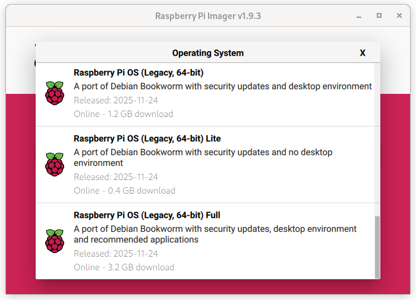

  3. Storage: the MicroSD card (32GB).

     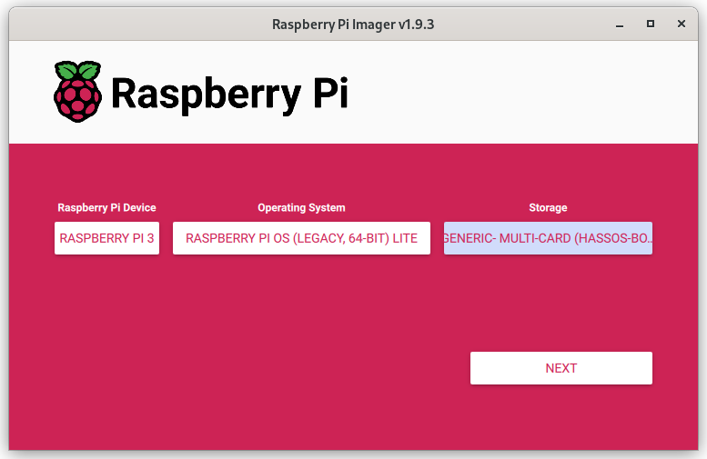

     Also Click "EDIT SETTINGS" to customize the System: 

     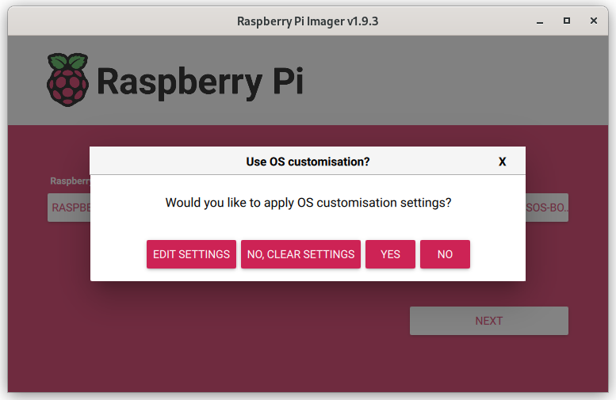

     At "General" tab, define the hostname, username, password, timezone and keyboard layout.

     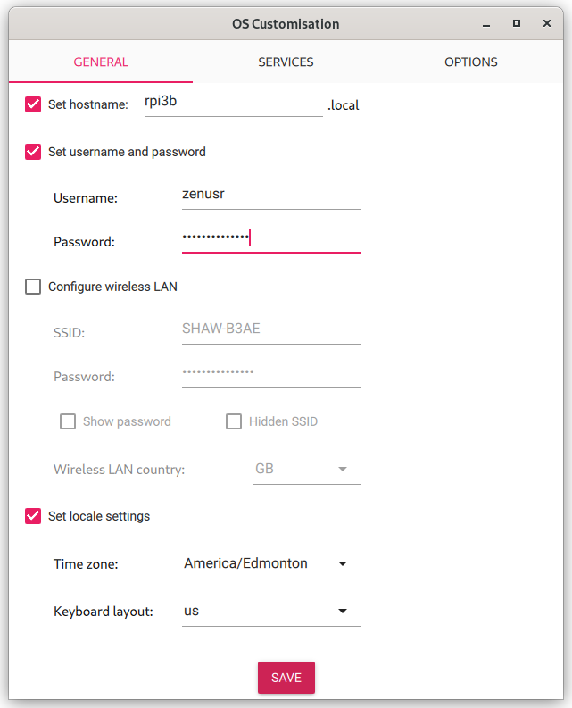

     At "Services" tab: Enable SSH and toggle on "Use password authentication":

     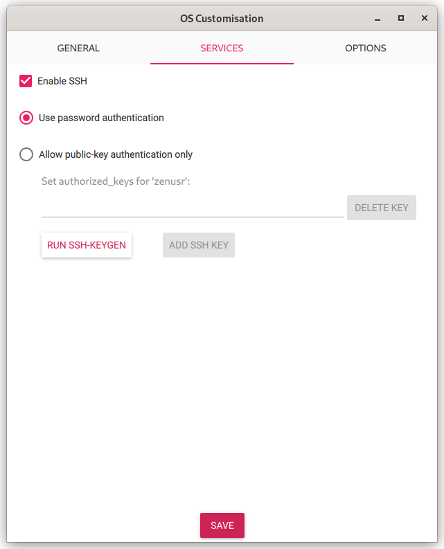

  4. Click "**Yes**" and "**NEXT**" to proceed till finishing off the imaging.

     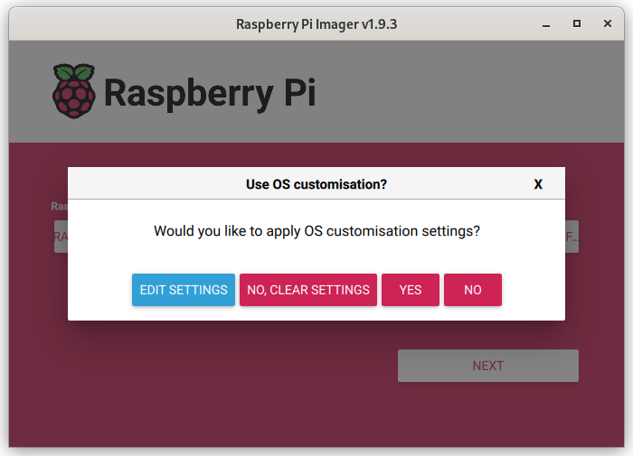
  
     5. Click "Continue" to finish off the imaging process
  
        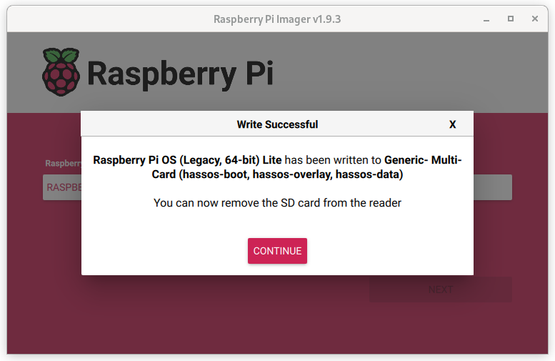


**2- Plug the MicroSD card back to the Raspberry Pi 3B+**  and boot it up with an Ethernet connection. Once it's up, use "**Angry IP Scanner**" to figure out the local private IP address. Mine is "**10.0.0.241**".

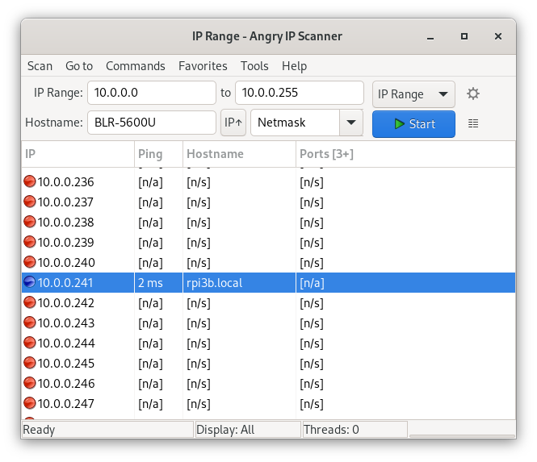

**3- SSH into the rpi3b at 10.0.0.241**: 

```shell 
# SSH
ssh zenusr@10.0.0.241
## Accepth the password autehntication and Type in the password we defined in step 1.4

# Check out info
uname -a

# Update the system
sudo apt update && sudo apt dist-upgrade -y

# If error: 
# locale: Cannot set LC_ALL to default locale: No such file or directory
sudo nano /etc/locale.gen
## Uncomment the entry: en_US.UTF-8
sudo locale-gen
```

**3- Transition the networking serivice** from `ifupdown` to `NetworkManager`:

```shell
sudo apt install -y network-manager systemd-resolved
# If error: 
# Failed to fetch http://deb.debian.org/debian/dists/bookworm/InRelease 
# Temporary failure resolving 'deb.debian.org'
echo "nameserver 8.8.8.8" | sudo tee /etc/resolv.conf > /dev/null
sudo systemctl restart systemd-resolved

# The network interface name might be different depending on your setup. 
# For a default network setup using DHCP the following commands work.
sudo systemctl restart systemd-resolved.service
sudo systemctl disable --now networking.service ## There might be no networking service
sudo mv /etc/network/interfaces /etc/network/interfaces.disabled ## may be no such file
sudo systemctl restart NetworkManager
# Your system might have a new IP address at this point, probably because the DHCP server id used by NetworkManager appears to be different.
ip a
## eth0: ...
## inet 10.0.0.241/24 brd 10.0.0.255 scope global
```


**4- Install Docker-CE**

```shell
# Prerequisites
sudo apt install -y apparmor bluez cifs-utils curl dbus jq libglib2.0-bin lsb-release nfs-common systemd-journal-remote udisks2 wget
# Install Docker-CE - This takes quite a while
curl -fsSL get.docker.com | sh

# Give your local account access to docker without needing to `sudo` each time:
sudo usermod -aG docker zenusr
```

> [!CAUTION]
>
> REBOOT your machine now, otherwise the local user can NOT be added into `docker` group!
>
> ```
> sudo reboot
> ```

Once it comes back, check if the local user is added into `docker` group.

```shell
id
```


**5- Install OS-Agent**: 

The OS Agent is pre-installed with the Home Assistant Operating System. As we are starting from scratch - a base Debian 12, then we need to install OS Agent manually. Instructions for installing the OS-Agent can be found [here](https://github.com/home-assistant/os-agent/tree/main#using-home-assistant-supervised-on-debian).

Go to https://github.com/home-assistant/os-agent/releases/latest to find what the latest version is.

```shell
# Download the latest Debian package from OS Agent GitHub release page
wget https://github.com/home-assistant/os-agent/releases/download/1.8.1/os-agent_1.8.1_linux_aarch64.deb
# Install the downloaded Debian package:
sudo dpkg -i os-agent_1.8.1_linux_aarch64.deb
# You can test if the installation was successful by running:
busctl introspect --system io.hass.os /io/hass/os
```

This should **not** return an error. If you get an object introspection with `io.hass.os`, `interface` etc. OS Agent is working as expected.


**6- Install Home-Assistant Supervised** Debian package:

```shell
# download homeassistant-supervised package
wget https://github.com/home-assistant/supervised-installer/releases/latest/download/homeassistant-supervised.deb

## Install the package
sudo apt install ./homeassistant-supervised.deb
## If complaining "Rasbian on Debian is not supported", then bypass OS check:
sudo BYPASS_OS_CHECK=true apt install ./homeassistant-supervised.deb
```

Then select "**raspberrypi3-64**", but a generic "**qemuarm64**" shall work for any 64-bit ARM device.

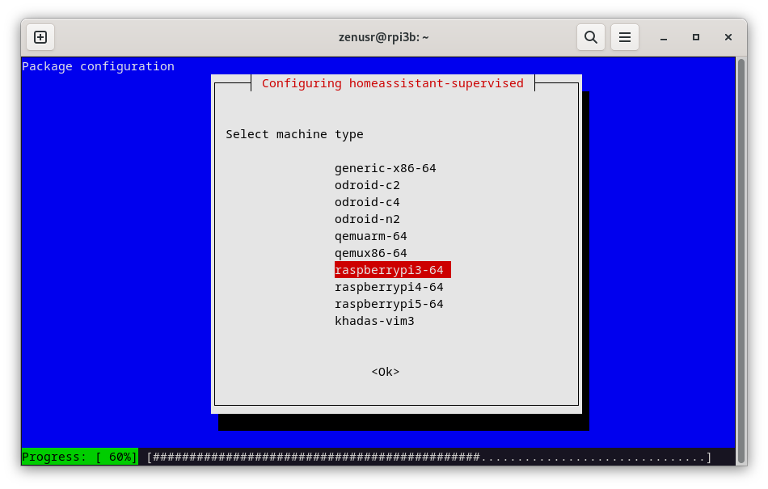

It may take quite a while to launch 6 base containers. Feel free to take a look at what's going on behind the scene.

```shell
sudo journalctl -f
docker stats
```

> [!NOTE]
>
> Once it completes successfully, it is best to give the system one last reboot. If you do not, after your initial Home Assistant setup, you will see an error in the System Settings within the Home Assistant UI, that it does not have privileged access to Docker. Reboot fixes that (now, or anytime after, but don’t start loading up Add-Ons before you do reboot, as these are Docker images).


Meanwhile, we should be able to hit the webUI at `http://ipaddress:8123` and see the Preparing Home Assistant message.

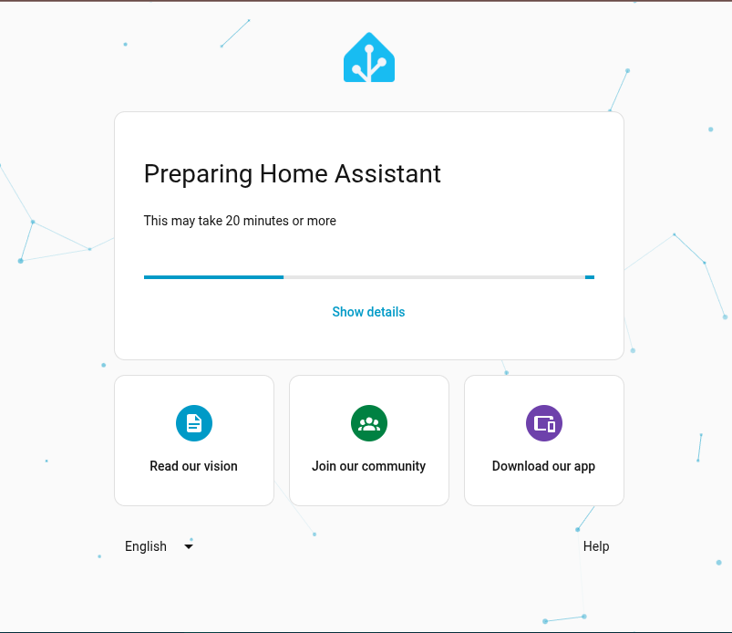


**7- On-boarding**: The system shall bring you to a onboarding page of the HAOS, where you get a chance to create a local HAOS user and the relevant password.

At the "**Welcome!**" window, click "Create my smart home" to proceed.

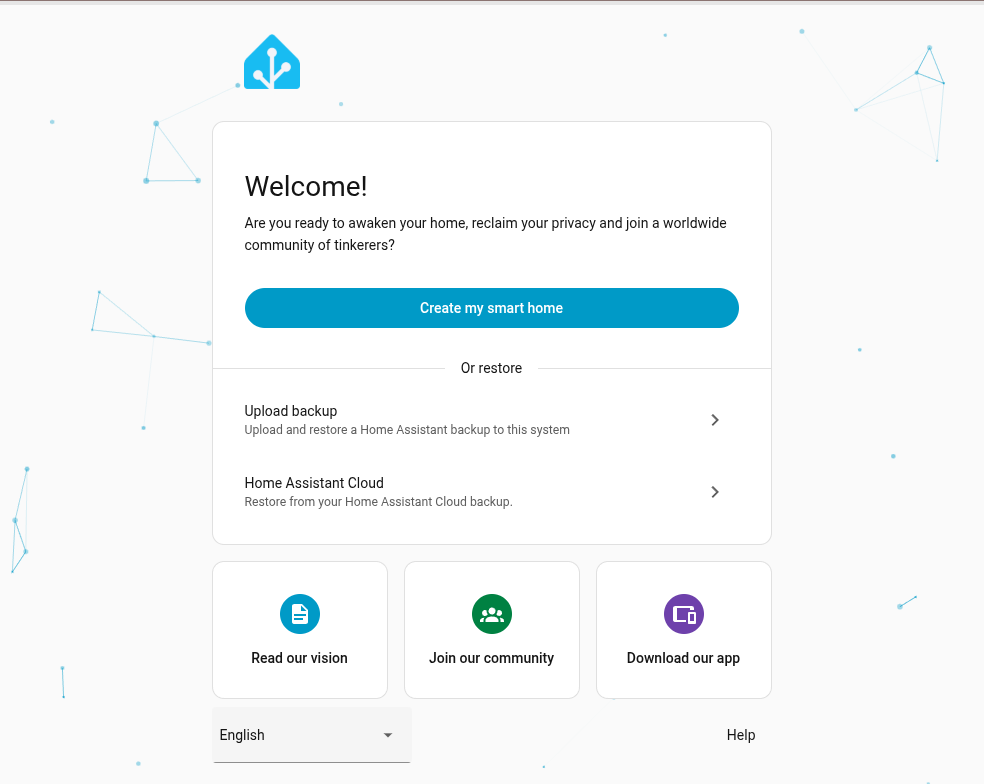

At the "**Create user**" step, note down the username and password you define here for future use.

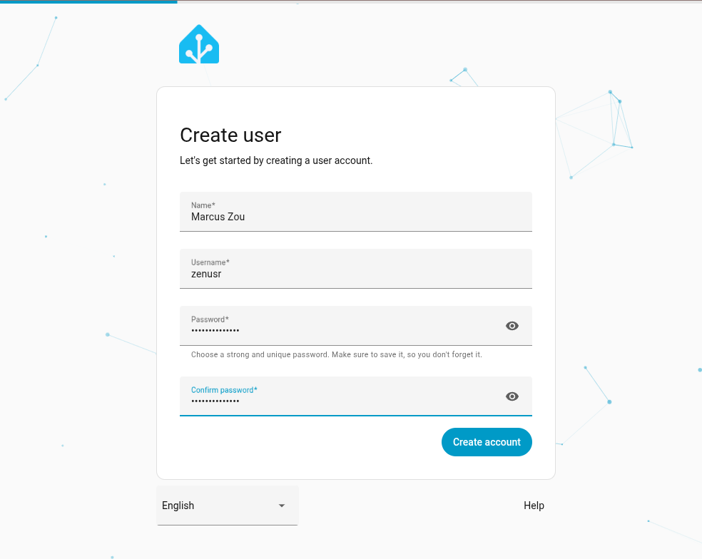

At the "**Home location**" step, even though you you type in the exact home address with your postal code, the pin point cannot be exactly whatsoever location. Then you can go to Google Maps, locate your home location, right click to copy the Lat/Lon pair and paste into the "Search Address" box, you shall get the exact location, feel free to move the pin to the exact location of your home.

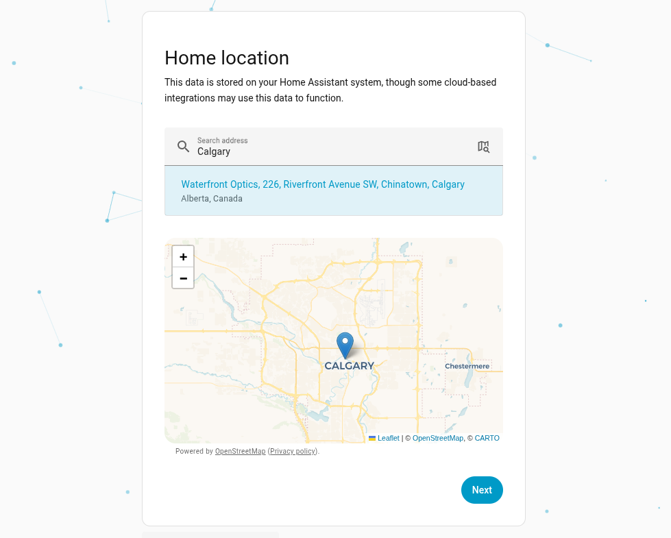

At the "**Help us help you**" step: Nothing to change here, proceed to next step.

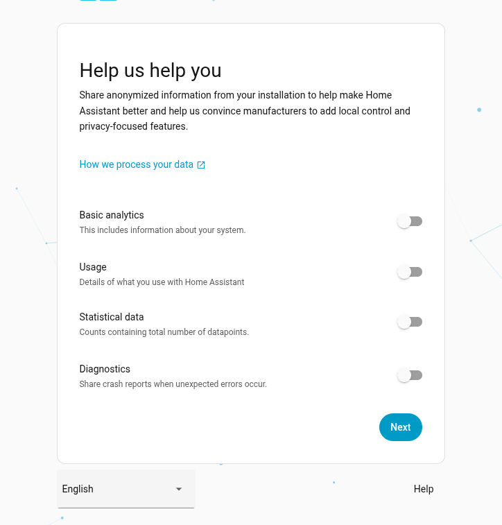

Finally you are able to find compatible devices! Hola.

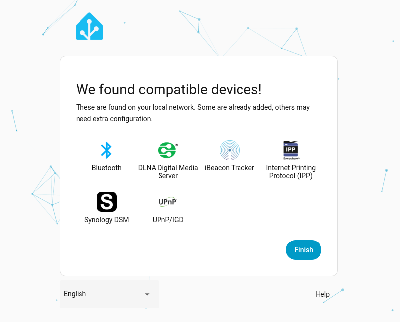


**8- Setup SSH to access the container of HAOS**: Once loaded, Click "Settings" icon at lower-left corner.

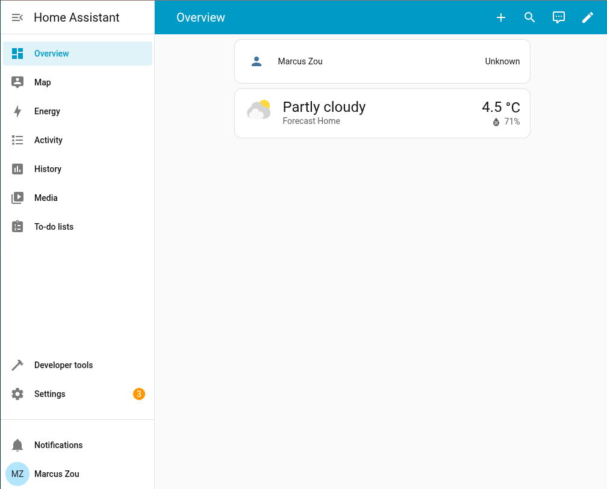

Check the "**Settings**" -> "**About**" page:

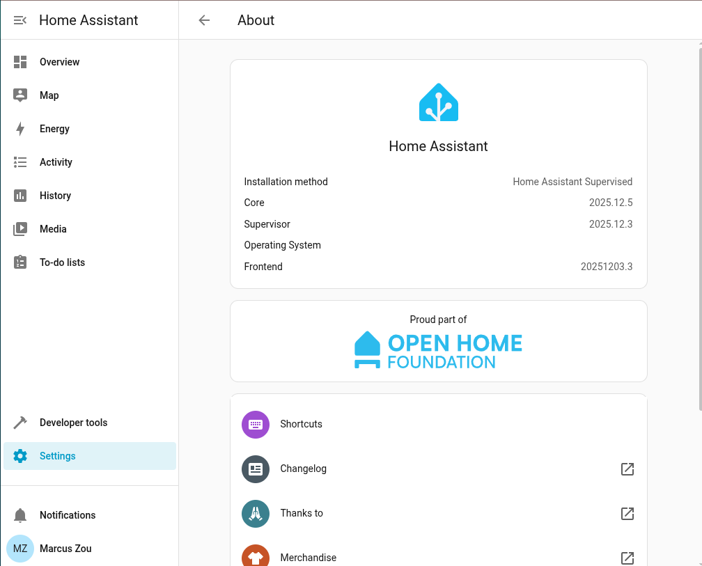


**10- Add SSH**: Click "**Settings**" -> "**Add-ons**" -> choose "**Terminal & SSH**" at the Official add-ons page. Then click "**Install**" to install it. Now configure the usename/password at the "Configuration":

At "**Options**" section, ensure the password is strong enough.

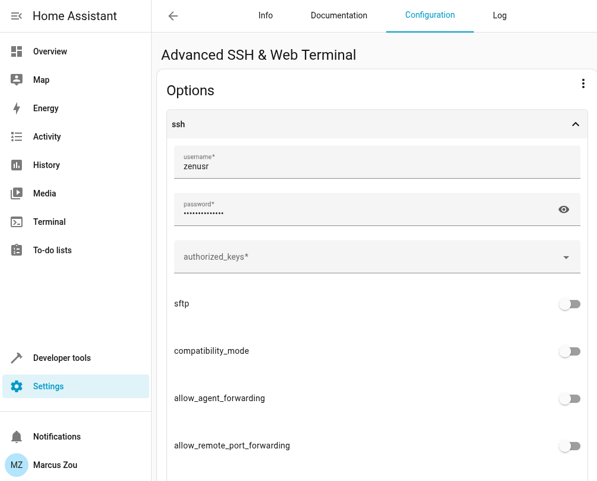

At the "**Network**" section, change the default port of SSH from "22" to something else, say "2222". This is a secure measure of the newly released HA OS and Supervised.

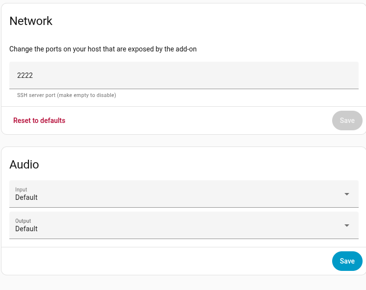

Eventually toggle on "Watchdog and "Add to sidebar" to pin the "Terminal" to the sidebar. and Start the terminal:

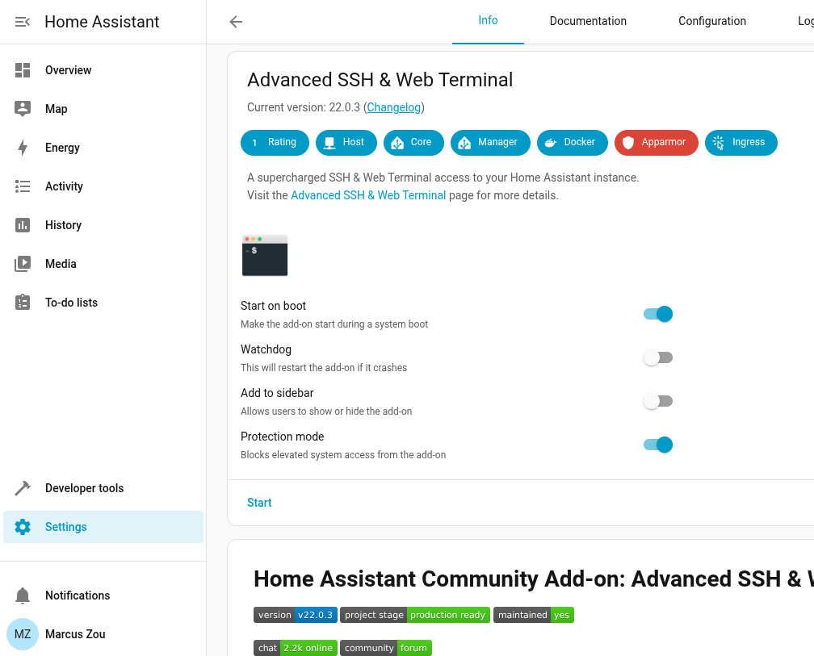

**11- Locate the Terminal inside the HAOS container**: Click "**Terminal**" at the left pane, you shall see the Home Assistant command line interface page in black and white:

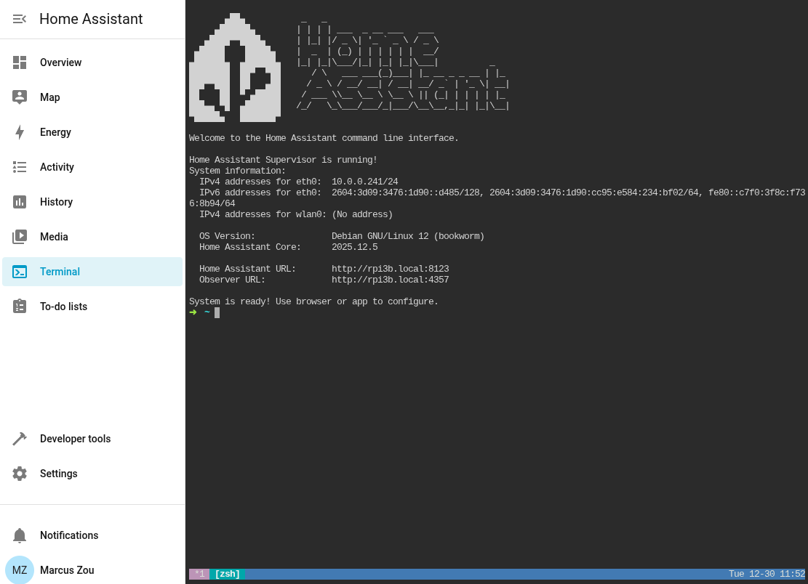

**12- Configure the forwarding and add the trusted proxies**: 

```shell
pwd
## /root
whoami
## root
nano config/configuration.yaml
```

Add the following lines and save the `config/configuration.yaml` file.

```text
http:
  use_x_forwarded_for: true
  trusted_proxies:
  	- 10.0.0.50      ## Internal IP address of where the reverse proxy is located
  	- 68.146.xx.xx   ## Publich Ip address
```


**13- Add 2 entries of "WebSocket" in the proxy header file**: Go to the Synology NAS - Web UI, open "**Control Panel**" -> "**Login Portal**" -> "**Advanced**" tab -> "**Reverse Proxy**" -> select the very proxy: homea.example.com, which is reverse-proxied to 10.0.0.241:8123 -> click "**Edit**". Then switch to "**Custom Header**" tab; click "**Create**" to select "**WebSocket**", then the following 2 lines shall be in place:

```text
Upgrade = $http_upgrade
Connection = $connection_upgrade
```

The save such and exit.

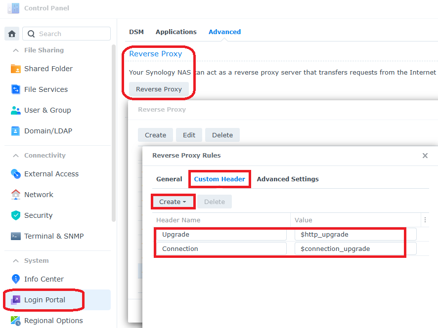


As such, there will be neither "Error 400: Bad Request", nor "Error 500: Bad Gateway".

Hola, a beautiful day, isn't it?


## End

