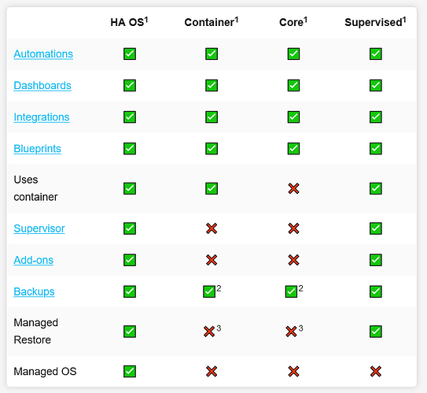

# Everything about Home-Assistant

by marcuz-apl | 28 December 2025


A Home-Assistant project can be as easy as running up with a HAOS on a Raspberry PI. But there might be some pitfalls on the way. Also, we'll try the Home-Assistant in Docker Container.


## Part 3- Home Assistant in Docker Container

There are a few Docker  containers from Docker Hub; a typical docker compose file could be as below:

```shell
services:
  homeassistant:
    #image: ghcr.io/home-assistant/home-assistant:stable
    image: homeassitant/home-assistant:stable
    container_name: homea
    cap_add:
      - NET_ADMIN
    volumes:
      - ./config:/config
      - /etc/localtime:/etc/localtime:ro
      - /run/dbus:/run/dbus:ro
    environment:
      TZ: America/Edmonton
    restart: unless-stopped
    privileged: true
    network_mode: host
```

But the main issue of the container is the HA Container doesn't include "Add-ons" module, which made the containers are just for showing, not practical at all. then forget about it unless we re-write the docker container from dockerfile or install Home-Assistant Supervised container parallel.




## End