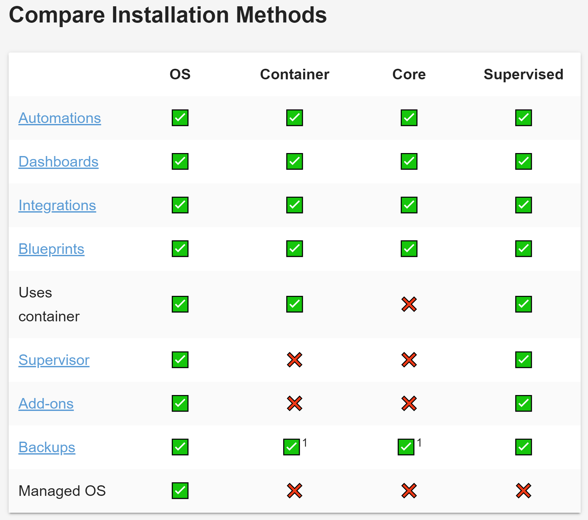
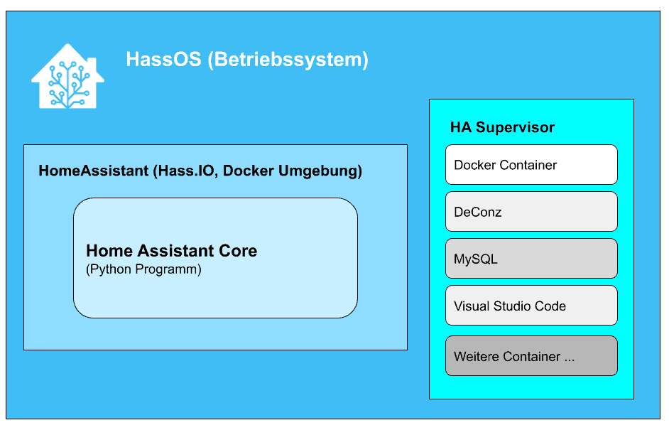

# Everything about Home-Assistant System

by marcuz-apl | 28 December 2025

## Intro

A Home-Assistant project can be as easy as running up with a HAOS on a Raspberry PI. But there might be some pitfalls on the way.

Theoretically, The best way is to install HA OS on a Raspberry PI device since Home-Assistant company starts its business from Raspberry.

AT this moment, there are 3 major ways or supported install methods to deploy your  HA project:

- **HA OS** (on a Raspberry Pi 3B+ or equivalent device)
- **HA Supervised** (start from Debian 12 CLI mode while installing quite a few apps)
- **HA Container**

I would like to try HA Container, but obviously, the main issue is the HA Container doesn't include "Add-ons" module, which made the container is just for showing, not practical at all. then forget about it unless we re-write the docker container from dockerfile.

## Install Methods Comparison

## We will go through the 3 methods

- HA OS: [Part-1-Install-Home-Assistant-OS-on-Raspberry-Pi-3B](./Part-1-Install-Home-Assistant-OS-on-Raspberry-Pi-3B.md)
- HA Supervised: [Part-2-Install-HA-Supervised-on-Any-Raspberry-Pi-Eqiv-Hardware](./Part-2-Install-HA-Supervised-on-Any-Raspberry-Pi-Eqiv-Hardware.md)

* HA Container: [Part-3-Install-Home-Assistant-Container](./Part-3-Install-Home-Assistant-Container.md)

## Home Assistant Structure

## End